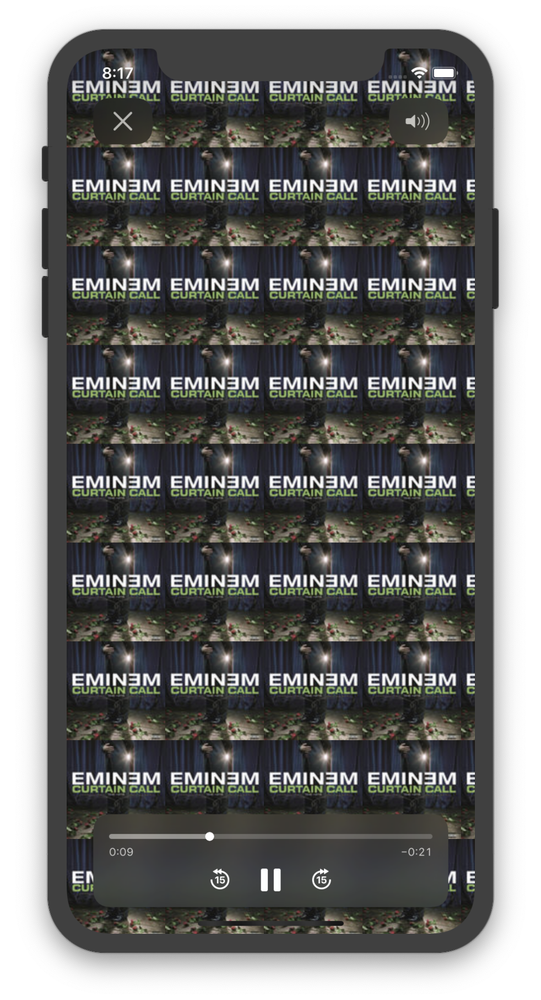

# Tunes
Learn how to use URLSession to request data from online APIs, and how to parse the response using Swift's Codable protocol. This application uses the iTunes API to search and play 30 seconds previews of songs.

 

